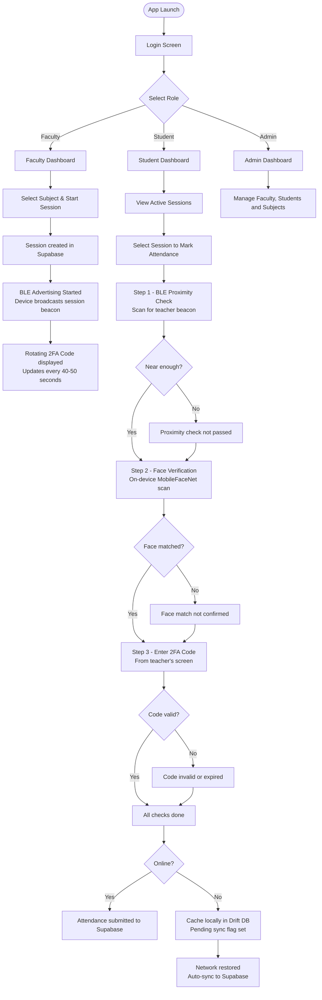

# Upastithi Pramaan (उपस्थिति प्रमाण)

<div align="center">

**Offline-first · Multi-modal · Anti-Fraud Attendance Verification System**

*Built with Flutter & Native Kotlin — for educational institutions*

</div>

---

## 📌 Overview

**Upastithi Pramaan** (Attendance Proof) is an advanced mobile attendance system engineered to eliminate proxy/fraudulent marking. It enforces physical presence through a **triple-factor verification engine**:

| # | Factor | Technology | Threshold |
|---|--------|------------|-----------|
| 1 | **BLE Proximity** | Native Kotlin BLE Advertiser/Scanner | RSSI ≥ −65 dBm |
| 2 | **On-Device Face Match** | MobileFaceNet via TensorFlow Lite | Euclidean distance < 0.45 |
| 3 | **Rolling 2FA Code** | Server-side rotating 6-char code | Expires every 40–50 seconds |


---

## 🔄 How It Works



---

## ✨ Key Features

- 🔌 **Offline-first** — attendance is cached locally in Drift (SQLite) when offline and auto-synced on reconnect
- 📡 **Native BLE** — custom Kotlin module handles BLE advertising (teacher) and scanning (student), bypassing Flutter plugin limitations on Android 12+
- 🧠 **On-device AI** — face recognition runs entirely on-device using MobileFaceNet; no images are ever sent to a server
- 👤 **Three user roles** — Student, Faculty (Teacher), Admin — each with separate login flows and dashboards
- 🔒 **SHA-256 password hashing** — passwords are never stored in plaintext; all authentication is done via Supabase PostgreSQL
- 🗄️ **Reactive state** — entire app state is managed via Riverpod (`NotifierProvider`, `StreamProvider`, `StateProvider`)

---

## 🏗️ Architecture

```
┌─────────────────────────────────────────────────────────────────┐
│                        Flutter / Dart Layer                     │
│                                                                 │
│  ┌──────────┐  ┌──────────┐  ┌──────────┐  ┌──────────────┐     │
│  │  Auth    │  │ Student  │  │ Teacher  │  │    Admin     │     │
│  │ Feature  │  │ Feature  │  │ Feature  │  │   Feature    │     │
│  └────┬─────┘  └────┬─────┘  └────┬─────┘  └──────┬───────┘     │
│       │             │             │               │             │
│  ┌────▼─────────────▼─────────────▼───────────────▼──────────┐  │
│  │              Services (Riverpod Providers)                │  │
│  │  AuthService · SessionService · FaceMLService · BleService│  │
│  └──────────────────────────┬────────────────────────────────┘  │
│                             │                                   │
│  ┌──────────────────────────▼────────────────────────────────┐  │
│  │                  Data Layer                               │  │
│  │  AppDatabase (Drift/SQLite)  ·  Supabase Client           │  │
│  └───────────────────────────────────────────────────────────┘  │
│                             │                                   │
│  ┌──────────────────────────▼────────────────────────────────┐  │
│  │          Platform Bridge (ble_channel.dart)               │  │
│  └──────────────────────────┬────────────────────────────────┘  │
└─────────────────────────────┼───────────────────────────────────┘
                              │
┌─────────────────────────────▼───────────────────────────────────┐
│               Native Android / Kotlin Layer                     │
│   MainActivity.kt · BleAdvertiser.kt · BleScanner.kt            │
└─────────────────────────────────────────────────────────────────┘
```

---

## 🛠️ Tech Stack

### Framework & Language

| | Detail |
|---|---|
| **Flutter SDK** | `>=3.22.0` |
| **Dart SDK** | `>=3.3.0 <4.0.0` |
| **Android minSdk** | `26` (Android 8.0) |
| **Android targetSdk** | `34` |
| **Kotlin** | `1.9.22` |

### Flutter Dependencies

| Package | Version | Role |
|---------|---------|------|
| `supabase_flutter` | `^2.5.0` | Remote auth, cloud PostgreSQL, session management |
| `go_router` | `^14.2.0` | Declarative, URL-based routing with role guards |
| `flutter_riverpod` | `^2.5.1` | Reactive state management |
| `riverpod_annotation` | `^2.3.5` | Code-gen annotations for Riverpod |
| `drift` | `^2.18.0` | Type-safe SQLite ORM for offline storage |
| `drift_flutter` | `^0.2.0` | Flutter-specific Drift helpers |
| `camera` | `^0.11.0+2` | Live camera stream for face capture |
| `google_mlkit_face_detection` | `^0.11.0` | On-device face detection |
| `tflite_flutter` | `^0.11.0` | Native TFLite interpreter (MobileFaceNet) |
| `flutter_blue_plus` | `^1.32.12` | BLE support (supplementary) |
| `permission_handler` | `^11.3.1` | Runtime Camera, BLE, Location permissions |
| `connectivity_plus` | `^6.0.3` | Network status monitoring for sync trigger |
| `crypto` | `^3.0.3` | SHA-256 password hashing |
| `uuid` | `^4.4.0` | Session UUID generation |
| `logger` | `^2.3.0` | Structured console logging |

### Dev Dependencies

| Package | Role |
|---------|------|
| `build_runner` | Code generation runner |
| `drift_dev` | Drift schema + DAO code generator |
| `riverpod_generator` | Riverpod provider code generator |
| `freezed` | Immutable class boilerplate generator |
| `json_serializable` | JSON encode/decode boilerplate |

---

## 📂 Project Structure

```
upastithi_pramaan/
│
├── android/
│   └── app/src/main/
│       ├── AndroidManifest.xml          # Permissions: BLE, Camera, Internet
│       └── kotlin/com/upastithi/upastithi_pramaan/
│           ├── MainActivity.kt          # Flutter engine setup, channel wiring, permissions
│           ├── BleAdvertiser.kt         # Native BLE peripheral for teacher broadcasting
│           └── BleScanner.kt            # Native BLE scanner for student proximity detection
│
├── assets/
│   ├── models/mobilefacenet.tflite      # Pre-trained face embedding model
│   └── images/
│
├── lib/
│   ├── main.dart                        # Entry point: Supabase init + ProviderScope
│   ├── app/
│   │   ├── app.dart                     # MaterialApp.router + theme
│   │   └── routes.dart                  # GoRouter with all named routes
│   ├── core/
│   │   ├── constants/                   # App-wide constants and config values
│   │   ├── theme/                       # Material ThemeData
│   │   └── utils/                       # Logger, session code generator
│   ├── data/
│   │   ├── local/                       # Drift database, table models
│   │   ├── models/                      # AppUser, SessionModel
│   │   └── sync/                        # (Reserved) background sync logic
│   ├── features/
│   │   ├── auth/                        # Login & registration screens
│   │   ├── student/                     # Student dashboard, face verification, BLE scan, code entry
│   │   ├── teacher/                     # Teacher dashboard, session management, rotating code
│   │   └── admin/                       # Admin portal: manage faculty, subjects, students
│   ├── platform/
│   │   └── ble_channel.dart             # Dart-side bridge to native Kotlin BLE module
│   └── services/
│       ├── auth_service.dart            # Login logic for all three roles
│       ├── ble_service.dart             # BLE state management (Riverpod Notifier)
│       ├── face_ml_service.dart         # On-device face recognition pipeline
│       └── session_service.dart         # Supabase session CRUD & attendance submission
│
├── pubspec.yaml
└── README.md
```

---

## 📡 Native BLE Module (Kotlin)

The proximity engine is implemented natively in Kotlin to handle Android BLE stack quirks that Flutter plugins cannot reliably work around.

- **Teacher device** acts as a BLE peripheral, broadcasting a compact session identifier in each advertising packet.
- **Student device** scans for nearby teacher beacons and computes a smoothed signal strength average to confirm physical proximity.
- Communication between Flutter and Kotlin is done via Flutter's `MethodChannel` (commands) and `EventChannel` (scan result stream).
- Permissions are handled adaptively for both Android ≤ 11 and Android 12+.

---

## 👁️ On-Device Face Recognition

All biometric processing happens locally on the device — no face images are transmitted to any server.

1. **Detect** — ML Kit identifies a face in the live camera feed.
2. **Process** — The face region is extracted and pre-processed into the format required by the model.
3. **Infer** — MobileFaceNet (via TFLite) generates a compact 128-dimensional face embedding.
4. **Match** — The live embedding is compared against the student's stored enrollment template. A match is confirmed if the distance falls below the configured threshold.

During **enrollment**, 5 captures are averaged to create a robust template stored locally in the Drift database.

---

## 🗄️ Database Schema

### Local (Drift / SQLite)

#### `student_embeddings`
| Column | Type | Notes |
|--------|------|-------|
| `id` | TEXT PK | Student UUID |
| `student_name` | TEXT | Display name |
| `student_roll_number` | TEXT (nullable) | University roll number |
| `embedding` | BLOB | Serialised 128-d face vector |
| `enrolled_at` | INTEGER | Epoch milliseconds |
| `synced` | BOOLEAN | Upload status flag |

#### `attendance_logs`
| Column | Type | Notes |
|--------|------|-------|
| `id` | TEXT PK | Record UUID |
| `student_id` | TEXT | FK → Student UUID |
| `session_uuid` | TEXT | Target class session ID |
| `teacher_name` | TEXT | Cached teacher name |
| `room_code` | TEXT | Classroom identifier |
| `proximity_verified` | BOOLEAN | BLE check result |
| `face_verified` | BOOLEAN | Face match result |
| `code_verified` | BOOLEAN | 2FA code result |
| `captured_at` | INTEGER | Epoch milliseconds |
| `synced` | BOOLEAN | Upload status flag |

### Cloud (Supabase PostgreSQL)

| Table | Purpose |
|-------|---------|
| `users` | Base user record with `role` and `password_hash` |
| `students` | Student profile: roll, division, semester, department |
| `faculty` | Faculty profile: emp_id, name, department |
| `subjects` | Subject catalogue |
| `sessions` | Active class sessions with rotating 2FA code |
| `attendance_records` | Final records with fraud score |

---

## 🔀 Application Routes

| Route | Screen |
|-------|--------|
| `/login` | `LoginScreen` — tab-based (Student / Faculty / Admin) |
| `/register` | `RegisterScreen` — student self-registration + face enrollment |
| `/student` | `StudentDashboard` |
| `/teacher` | `TeacherDashboard` |
| `/admin` | `AdminDashboard` |
| `/admin/add-faculty` | `AddFacultyScreen` |
| `/admin/subjects` | `ManageSubjectsScreen` |
| `/admin/students` | `ViewStudentsScreen` |
| `/admin/faculty` | `ViewFacultyScreen` |

---

## 🔑 Authentication & Roles

| Role | Login credential | Redirected to |
|------|-----------------|---------------|
| **Student** | Roll number + password | `/student` |
| **Faculty** | Employee ID + password | `/teacher` |
| **Admin** | Password only (single account) | `/admin` |

Passwords are hashed with SHA-256 before being stored. Session state is maintained in a Riverpod `StateProvider`.

---

## 📱 Android Permissions

| Permission | Reason |
|------------|--------|
| `BLUETOOTH_SCAN`, `BLUETOOTH_ADVERTISE`, `BLUETOOTH_CONNECT` | BLE operations (Android 12+) |
| `ACCESS_FINE_LOCATION` | Required for BLE on Android ≤ 11 |
| `CAMERA` | Face capture |
| `INTERNET` | Supabase sync |
| `ACCESS_NETWORK_STATE` | Connectivity check for sync trigger |

---

## 🚀 Getting Started

### Prerequisites

- **Flutter SDK** `>=3.22.0` ([install](https://docs.flutter.dev/get-started/install))
- **Android Studio** with Android SDK
- **Physical Android device** — BLE advertising/scanning does not work on most emulators

### Setup

1. **Clone the repository**
   ```bash
   git clone https://github.com/aryan-oo9/upastithi-pramaan-ble.git
   cd upastithi-pramaan-ble
   ```

2. **Configure Supabase**

   Open `lib/core/constants/supabase_constants.dart` and replace the placeholder values:
   ```dart
   static const String supabaseUrl = 'https://<your-project>.supabase.co';
   static const String supabaseAnonKey = '<your-anon-key>';
   ```

3. **Install Flutter dependencies**
   ```bash
   flutter pub get
   ```

4. **Run code generators** (Drift, Riverpod, Freezed)
   ```bash
   flutter pub run build_runner build --delete-conflicting-outputs
   ```

5. **Run on a connected device**
   ```bash
   flutter run
   ```

---

## ⚙️ Key Configuration

All tunable constants live in `lib/core/constants/app_constants.dart`:

| Constant | Default | Description |
|----------|---------|-------------|
| `faceMatchThreshold` | `0.45` | Face recognition sensitivity |
| `faceEnrollmentCaptures` | `5` | Frames averaged during enrollment |
| `rssiThreshold` | `−65 dBm` | Minimum signal for proximity confirmation |
| `rssiWindowSize` | `7 packets` | BLE signal smoothing window |
| `sessionCodeLength` | `6 chars` | Length of the rotating 2FA code |
| `sessionCodeRefreshMinSeconds` | `40 s` | Min code rotation interval |
| `sessionCodeRefreshMaxSeconds` | `50 s` | Max code rotation interval |

---

## 🔒 Security Highlights

- Passwords are hashed with **SHA-256** — never stored or transmitted in plaintext
- Face data is stored as **mathematical vectors only** — no biometric images leave the device
- Fraud scores are recorded **server-side** — the client cannot alter or suppress them
- BLE payload carries only a compact session identifier — not sensitive session data

---

## 📄 License

This project is for academic/educational purposes.
